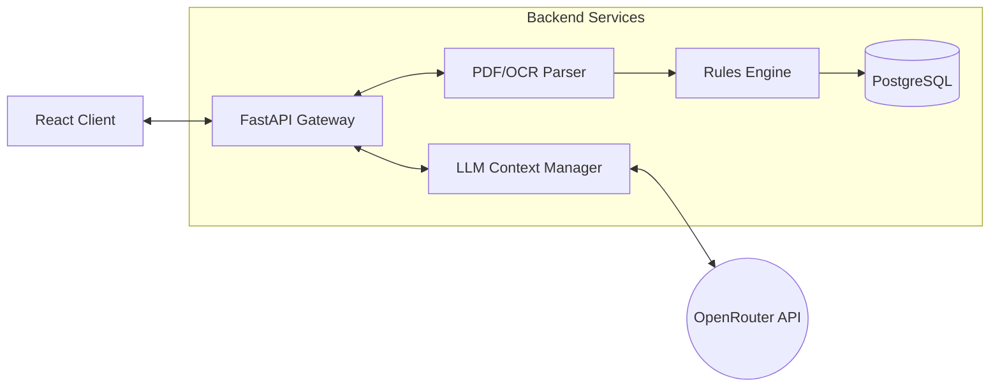

# Legal Document Intelligence

[](https://opensource.org/licenses/MIT)
[](https://www.python.org/downloads/)
[](https://reactjs.org/)

A specialized document analysis engine built to parse, evaluate, and extract insights from Indian legal contracts (Leases, NDAs, Employment Agreements, and Sale Deeds). 

> **Disclaimer:** This software provides technical document analysis, not legal advice. Output must be reviewed by a qualified legal professional before use in any legal capacity.

---

## Core Capabilities

The application processes PDF contracts through a deterministic rules engine combined with an LLM layer for contextual understanding.

| Feature | Description |
| :--- | :--- |
| **Automated Review** | Extracts clauses, detects document types, and flags missing essential terms based on contract type. |
| **Risk Scoring** | Generates a 0-100 risk score based on the severity of missing clauses and unbalanced terms. |
| **Contextual Q&A** | Chat interface that answers user questions using *only* the extracted clauses, providing direct citations. |
| **Clause Drafting** | Generates tailored replacement clauses for missing terms based on Indian commercial law standards. |
| **Fairness Analysis** | Identifies one-sided obligations and unbalanced penalty structures within the contract. |
| **Compliance Checks** | Verifies state-specific Stamp Duty rates, Registration limits, and Rent Control applicability. |
| **Template Validation** | Catches unfilled placeholders (e.g., `[NAME]`, `......`) to prevent execution of incomplete drafts. |
| **Document Diffing** | Side-by-side comparison of clause coverage and risk scores across two document versions. |

---

## System Architecture

The system uses a decoupled architecture. The React frontend communicates with a FastAPI backend that handles ingestion, rule evaluation, and external LLM routing.



### Technology Stack

* **Client:** React 18 (Vite), Custom CSS
* **Server:** FastAPI (Python 3.10+), SQLAlchemy 2.0
* **Storage:** PostgreSQL (production), SQLite (local dev)
* **Processing:** PyMuPDF, pytesseract (OCR fallback)
* **AI Routing:** OpenRouter API (Default: `google/gemma-4-31b-it:free`)

---

## Deployment & Setup

### Local Development Environment

Prerequisites: Python 3.10+ and Node.js.

1. **Backend Configuration**
   ```bash
   cd backend
   pip install -r requirements.txt
   cp .env.example .env
   ```
   *Note: Add your `OPENROUTER_API_KEY` to the `.env` file.*

2. **Start the API Server**
   ```bash
   python -m uvicorn app.main:app --reload
   ```

3. **Start the Frontend Client**
   ```bash
   cd ../frontend
   npm install
   npm run dev
   ```

### Cloud Deployment (Render)

This repository includes a `render.yaml` configuration for zero-downtime deployment on Render.

1. Create a New Blueprint instance on Render and connect this repository.
2. The blueprint will automatically provision the PostgreSQL database, FastAPI service, and React static site.
3. In the Render Dashboard, configure the environment variables for the API service:
   * `OPENROUTER_API_KEY`: Your provider key
   * `OPENROUTER_MODEL`: `google/gemma-4-31b-it:free` (or target model)
4. Re-deploy the API service to apply the environment variables.

---

## Data Privacy Note

Contracts uploaded to this system are processed in memory and persisted to the configured database to enable history and comparison features. This implementation is designed as a technical MVP and does not include the engineering controls required for DPDP Act compliance. Production deployments should implement data retention policies and encryption at rest.
