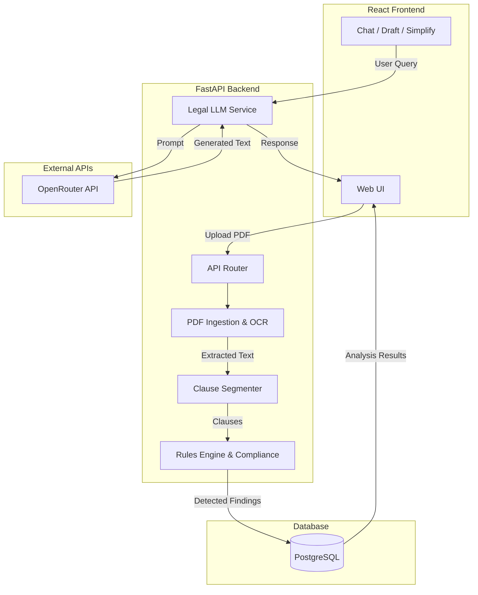

# ⚖️ Legal Document Intelligence (LDI)

An India-first, AI-powered legal document analysis tool designed to help individuals and professionals understand contracts, spot missing clauses, and negotiate fairer terms.

*Note: This is an AI-assisted document analysis tool, not an AI lawyer. It does not provide legal advice and does not replace review by a qualified legal professional.*

---

## ✨ Features

- **📄 Document Analysis**: Upload Lease Deeds, NDAs, Employment Contracts, and Sale Deeds. Automatically extracts clauses and detects the document type.
- **🚨 Risk Assessment**: Deterministic rule-based engine spots missing essential clauses (Governing Law, Dispute Resolution, Termination, etc.) and generates a weighted 0-100 Risk Score.
- **💬 Ask-the-Document Chat**: Ask specific questions (e.g., *"What happens if I pay rent late?"*) and get answers grounded **strictly** in the extracted clauses, with citations.
- **✨ AI Clause Drafting**: One-click generation of suggested legal clauses for any missing terms, tailored to Indian commercial law.
- **💡 Plain-Language Explainer**: Toggle dense legalese into plain, simple English that non-lawyers can easily understand.
- **⚖️ Fairness & Bias Check**: Analyzes the contract for one-sided terms (e.g., only the tenant pays penalties) and suggests how to make it fairer.
- **🇮🇳 State-wise Compliance**: Select your Indian state to get precise Stamp Duty rates, Registration limits, and Rent Control Acts (covers Maharashtra, Karnataka, Delhi, UP, Tamil Nadu, etc.).
- **🖨️ Document Comparison**: Upload two PDFs (e.g., an original lease and a revised version) to compare their clause coverage and risk scores side-by-side.
- **✍️ Incomplete Draft Detection**: Automatically catches unfilled placeholders (e.g., `[NAME]`, `......`) in template documents.

---

## 🛠️ Tech Stack

### Frontend
- **React 18** (Vite)
- **CSS3** (Custom responsive styling, no UI libraries)

### Backend
- **FastAPI** (Python 3.10+)
- **SQLAlchemy 2.0** (ORM)
- **PostgreSQL** (Database)
- **PyMuPDF & pytesseract** (PDF parsing and OCR fallback for scanned docs)

### AI & LLM
- **OpenRouter API** (Routing to `google/gemma-4-31b-it:free` and other LLMs)
- **TF-IDF & Cosine Similarity** (Lightweight legal source retrieval)

---

## 🏗️ Architecture & Flowchart



---

## 🚀 Getting Started

### 1. Local Setup

Make sure you have Python 3.10+ and Node.js installed.

**Backend Setup:**
```powershell
cd backend
python -m pip install -r requirements.txt
cp .env.example .env
```
*Edit your `.env` to include your OpenRouter API key and Database URL (SQLite or PostgreSQL).*

```powershell
# Run the backend API
python -m uvicorn app.main:app --reload
```

**Frontend Setup:**
```powershell
cd frontend
npm install
npm run dev
```

### 2. Cloud Deployment (Render)

This repository includes a `render.yaml` file for instant deployment on [Render](https://render.com/).

1. Connect your GitHub repository to Render and create a Blueprint.
2. Render will automatically provision:
   - A PostgreSQL Database
   - A Python Web Service (Backend API)
   - A Static Site (React Frontend)
3. In the Render Dashboard, set the following environment variables for the API:
   - `OPENROUTER_API_KEY`: Your OpenRouter API key
   - `OPENROUTER_MODEL`: `google/gemma-4-31b-it:free` (or your preferred model)
4. Your frontend will automatically be configured to point to your live API.

---

## 🛡️ Privacy & Legal Disclaimer

Uploaded contracts may contain sensitive personal and corporate data. While this MVP persists documents to a database for history and comparison features, **it does not constitute DPDP Act compliance**. 

A production deployment requires strict engineering controls around data retention, encryption at rest, and legal review before broad commercial release. Always keep API keys server-side and never commit them to version control.
