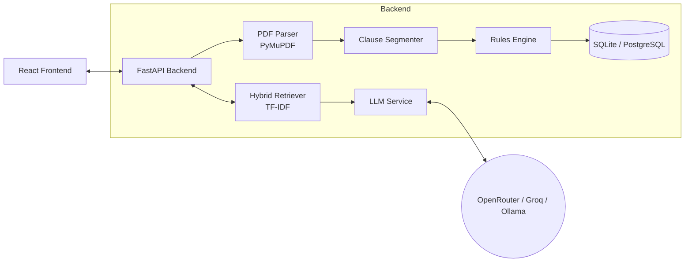

# Legal Document Intelligence

[](https://www.python.org/downloads/)
[](https://reactjs.org/)
[]()
[](https://opensource.org/licenses/MIT)

A specialized document analysis engine built to parse, evaluate, and extract insights from Indian legal contracts — Leases, NDAs, Employment Agreements, Sale Deeds, and Service Agreements.

> **Disclaimer:** This software provides technical document analysis, not legal advice. All output must be reviewed by a qualified legal professional before use in any legal capacity.

---

## Features

| Feature | Description |
| :--- | :--- |
| **Automated Review** | Extracts clauses, detects document type, and flags missing essential terms based on contract type. |
| **Risk Scoring** | Generates a 0–100 risk score weighted by severity of missing clauses and unbalanced terms. |
| **AI Analysis** | Evidence-grounded per-finding explanations, backed by indexed Indian legal sources. |
| **Document Summary** | Plain-English AI summary of the agreement in 3–5 paragraphs. |
| **Contextual Q&A** | Chat interface that answers questions using *only* the extracted clauses, with clause citations. |
| **Clause Drafting** | AI-generates replacement clauses for missing terms, grounded in Indian commercial law. |
| **Clause Simplification** | Rewrites any legal clause in plain English for non-lawyer readers. |
| **Fairness Analysis** | Identifies one-sided obligations, asymmetric penalties, and unbalanced indemnification. |
| **State Compliance** | Stamp Duty rates, Registration requirements, and Rent Control rules for 8 Indian states. |
| **Template Validation** | Detects unfilled placeholders (`[NAME]`, `......`) before a draft is executed. |
| **Document Comparison** | Side-by-side clause coverage and risk score diff across two documents. |
| **Guided Onboarding** | Interactive tour for first-time users with spotlight bubbles on every key feature. |

---

## Architecture

The React frontend communicates with a FastAPI backend that handles ingestion, rule evaluation, and LLM routing. No document text is sent to external APIs unless AI features are explicitly triggered.



### Technology Stack

| Layer | Technology |
| :--- | :--- |
| Frontend | React 18, Vite, custom CSS with design tokens |
| Backend | FastAPI (Python 3.10+), SQLAlchemy 2.0 |
| PDF Processing | PyMuPDF (digital PDFs only) |
| Retrieval | scikit-learn TF-IDF with authority-aware ranking |
| LLM Providers | OpenRouter, Groq, or local Ollama |
| Database | SQLite (local dev) / PostgreSQL (production) |

---

## Local Setup

**Prerequisites:** Python 3.10+ and Node.js 18+.

### 1. Backend

```bash
cd backend
pip install -r requirements.txt
```

Copy the environment template and fill in your values:

```bash
cp ../.env.example ../.env
```

Open `.env` and set at minimum:

```env
LLM_PROVIDER=openrouter          # or groq / ollama
OPENROUTER_API_KEY=sk-or-v1-...  # your key from openrouter.ai
```

Start the API server:

```bash
python -m uvicorn app.main:app --reload
```

The API will be available at `http://127.0.0.1:8000`.  
Interactive docs at `http://127.0.0.1:8000/docs` (development only).

### 2. Frontend

```bash
cd frontend
npm install
npm run dev
```

The app will open at `http://localhost:5173`.

### 3. (Optional) Index Legal Sources

To enable evidence-backed AI explanations, ingest the bundled Indian Contract Act source:

```bash
cd backend
python ../scripts/register_official_law.py
```

---

## LLM Provider Options

Set `LLM_PROVIDER` in `.env` to one of:

| Value | Description |
| :--- | :--- |
| `openrouter` | Cloud API — requires `OPENROUTER_API_KEY`. Free models available. |
| `groq` | Cloud API — requires `GROQ_API_KEY`. Very fast inference. |
| `ollama` | Local inference — requires Ollama running at `OLLAMA_BASE_URL`. No API key needed. |

---

## Running Tests

```bash
cd backend
python -m pytest tests/ -v
```

All 25 tests should pass. The test suite covers:

- Database schema validation
- PDF ingestion (valid PDFs, scanned PDFs, MIME rejection)
- Clause segmentation (numbered headings, plain headings, fallback patterns)
- Rules engine (missing clauses, lease-specific rules, incomplete drafts, date detection)
- LLM service (citation validation, JSON parsing, hallucination rejection)
- Legal source retrieval (authority ranking, insufficient evidence handling)
- API endpoints (full analyze → fetch → delete lifecycle)

---

## Cloud Deployment (Render)

A `render.yaml` blueprint is included for zero-downtime deployment.

1. Create a **New Blueprint** on [render.com](https://render.com) and connect this repository.
2. Render will provision the PostgreSQL database, FastAPI service, and React static site automatically.
3. In the Render Dashboard, set these environment variables on the API service:
   - `OPENROUTER_API_KEY` — your provider key
   - `APP_ENV=production` — disables Swagger/ReDoc docs
   - `DATABASE_URL` — auto-populated by Render's PostgreSQL add-on
4. Re-deploy to apply the variables.

---

## Project Structure

```
legal-ai/
├── backend/
│   ├── app/
│   │   ├── api/            # FastAPI route handlers
│   │   ├── core/           # Settings & config validation
│   │   ├── ingestion/      # PDF text extraction (PyMuPDF)
│   │   ├── legal_sources/  # Verified source loader & checksum validation
│   │   ├── retrieval/      # TF-IDF hybrid retriever
│   │   ├── rules/          # Deterministic rules engine + Indian compliance
│   │   ├── schemas/        # Pydantic models
│   │   ├── segmentation/   # Clause classifier & heading detection
│   │   ├── services/       # LLM provider abstraction (Ollama / OpenAI-compatible)
│   │   ├── db.py           # SQLAlchemy engine & session
│   │   ├── main.py         # FastAPI app, CORS, lifespan
│   │   └── models.py       # ORM models (Document, Clause, LegalFinding, LegalSource)
│   ├── tests/              # pytest test suite (25 tests)
│   └── requirements.txt
├── frontend/
│   └── src/
│       ├── components/     # Tour.jsx — onboarding tour component
│       ├── services/       # api.js — centralized API calls
│       ├── main.jsx        # App component
│       └── styles.css      # CSS with design tokens
├── data/
│   └── official/laws/      # Verified legal source JSON files
├── scripts/                # Ingestion & registration utilities
├── .env.example            # Environment variable template
└── render.yaml             # Render deployment blueprint
```

---

## Security Notes

- **API keys** are read from `.env` (gitignored) — never hardcode them in source files.
- The **`debug_retrieval` endpoint** has been removed from the production API surface.
- **AI features** are gated behind explicit user action — no document text leaves the server until the user clicks "Get AI Explanation", "Generate Summary", etc.
- All AI-generated text is labelled clearly and accompanied by a disclaimer.
- **Input validation** is enforced on all text fields (max lengths for questions, clause text, clause types).

---

## Data Privacy

Documents uploaded to this system are processed in-memory and persisted to the configured database to enable history and comparison features. This implementation does not include controls required for full DPDP Act compliance. Production deployments should implement:

- Data retention and automatic deletion policies (`RETENTION_DAYS` setting provided)
- Encryption at rest for the database
- Audit logging for document access

---

## License

MIT — see [LICENSE](LICENSE) for details.
